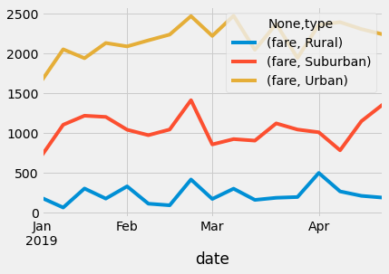

# PyBer Analysis

## Overview
V. Isualize has given you and Omar a brand-new assignment. Using your Python skills and knowledge of Pandas, you’ll create a summary DataFrame of the ride-sharing data by city type. Then, using Pandas and Matplotlib, you’ll create a multiple-line graph that shows the total weekly fares for each city type. Finally, you’ll submit a written report that summarizes how the data differs by city type and how those differences can be used by decision-makers at PyBer.

## Results
### Summary of the data

<table border="1" class="dataframe">
  <thead>
    <tr style="text-align: right;">
      <th></th>
      <th>total_rides</th>
      <th>total_drivers</th>
      <th>total_fares</th>
      <th>average_fare_per_ride</th>
      <th>average_fare_per_driver</th>
    </tr>
  </thead>
  <tbody>
    <tr>
      <th>Rural</th>
      <td>125</td>
      <td>537</td>
      <td>$4,327.93</td>
      <td>$34.62</td>
      <td>$8.06</td>
    </tr>
    <tr>
      <th>Suburban</th>
      <td>625</td>
      <td>8,570</td>
      <td>$19,356.33</td>
      <td>$30.97</td>
      <td>$2.26</td>
    </tr>
    <tr>
      <th>Urban</th>
      <td>1,625</td>
      <td>59,602</td>
      <td>$39,854.38</td>
      <td>$24.53</td>
      <td>$0.67</td>
    </tr>
  </tbody>
</table>

 

### Summary of Fares of 17 Weeks Divided by City Type
 

<table border="1" class="dataframe">
  <thead>
    <tr>
      <th></th>
      <th colspan="3" halign="left">fare</th>
    </tr>
    <tr>
      <th>type</th>
      <th>Rural</th>
      <th>Suburban</th>
      <th>Urban</th>
    </tr>
    <tr>
      <th>date</th>
      <th></th>
      <th></th>
      <th></th>
    </tr>
  </thead>
  <tbody>
    <tr>
      <th>2019-01-06</th>
      <td>$187.92</td>
      <td>$721.60</td>
      <td>$1,661.68</td>
    </tr>
    <tr>
      <th>2019-01-13</th>
      <td>$67.65</td>
      <td>$1,105.13</td>
      <td>$2,050.43</td>
    </tr>
    <tr>
      <th>2019-01-20</th>
      <td>$306.00</td>
      <td>$1,218.20</td>
      <td>$1,939.02</td>
    </tr>
    <tr>
      <th>$2019-01-27</th>
      <td>$179.69</td>
      <td>$1,203.28</td>
      <td>$2,129.51</td>
    </tr>
    <tr>
      <th>2019-02-03</th>
      <td>$333.08</td>
      <td>$1,042.79</td>
      <td>$2,086.94</td>
    </tr>
    <tr>
      <th>2019-02-10</th>
      <td>$115.80</td>
      <td>$974.34</td>
      <td>$2,162.64</td>
    </tr>
    <tr>
      <th>2019-02-17</th>
      <td>$95.82</td>
      <td>$1,045.50</td>
      <td>$2,235.07</td>
    </tr>
    <tr>
      <th>2019-02-24</th>
      <td>$419.06</td>
      <td>$1,412.74</td>
      <td>$2,466.29</td>
    </tr>
    <tr>
      <th>2019-03-03</th>
      <td>$175.14</td>
      <td>$858.46</td>
      <td>$2,218.20</td>
    </tr>
    <tr>
      <th>2019-03-10</th>
      <td>$303.94</td>
      <td>$925.27</td>
      <td>$2,470.93</td>
    </tr>
    <tr>
      <th>$2019-03-17</th>
      <td>$163.39</td>
      <td>$906.20</td>
      <td>$2,044.42</td>
    </tr>
    <tr>
      <th>2019-03-24</th>
      <td>$189.76</td>
      <td>$1,122.20</td>
      <td>$2,368.37</td>
    </tr>
    <tr>
      <th>2019-03-31</th>
      <td>$199.42</td>
      <td>$1,045.06</td>
      <td>$1,942.77</td>
    </tr>
    <tr>
      <th>2019-04-07</th>
      <td>$501.24</td>
      <td>$1,010.73</td>
      <td>$2,356.70</td>
    </tr>
    <tr>
      <th>2019-04-14</th>
      <td>$269.79</td>
      <td>$784.82</td>
      <td>$2,390.72</td>
    </tr>
    <tr>
      <th>2019-04-21</th>
      <td>$214.14</td>
      <td>$1,149.27</td>
      <td>$2,303.80</td>
    </tr>
    <tr>
      <th>2019-04-28</th>
      <td>$191.85</td>
      <td>$1,357.75</td>
      <td>$2,238.29</td>
    </tr>
  </tbody>
</table>

 

### Data of the Prevous Table Graphed

## Summary
As expected, the Urban areas get more fares than suburban and rural areas. Universally, there seems to be a spike in fares at the end of February. I assume because the weather tends to get nasty then.
